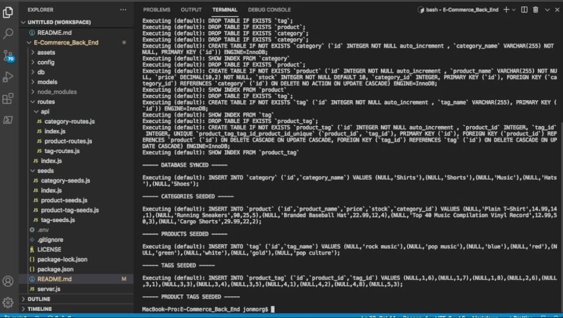
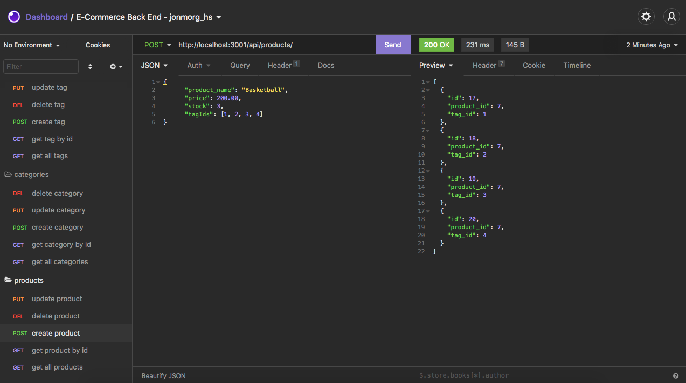

# E-Commerce_Back_End

# Table of Contents

- [Description](#description)
- [Installation](#installation)
- [Usage](#usage)
- [Insomnia_Demo](#insomnia_demo)
- [License](#license)

# Description

This project was developed for a e-commerce application with a backend for management of products, categories and tags, using NodeJS dependency Express.js API to use Sequelize to interact with a MySQL database.

# Installation

Install nodejs and dependencies (Express.js, Sequelize, mySQL2). The code includes a schema.sql file to create the database, with seeds to be installed using node (run seed).

# Usage

Insomnia can be used for data transfer testing.

# Setup_Demo

Click the image below to view the setup demo video on YouTube.

# Insomnia_Demo

Click the image below to view the Insomnia demo video on YouTube.

# License

MIT
